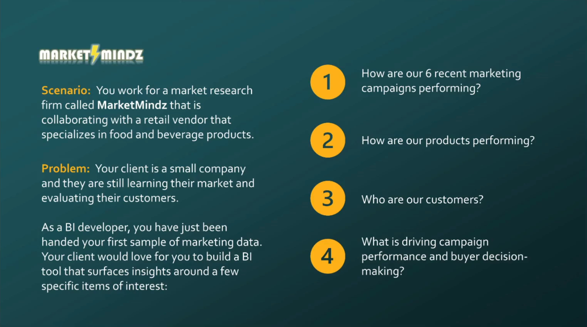

#  Market Mindz - Power BI Dashboard

This project is a guided project led by BI Lead Sean Chandler, a business intelligence professional with experience since 2014. It is one of four guided projects included in his Udemy course, [Microsoft Power BI Portfolio in a Day](https://www.udemy.com/course/microsoft-power-bi-portfolio-in-a-day/). 

Using a simulated dataset from a fictional company called **Market Mindz**, the project focuses on building an interactive sales performance dashboard to uncover insights into campaign effectiveness, product performance, and customer behavior.

## The Problem

## What I Learned

I chose to follow along with this course to gain insight into the mindset of an industry expert and to learn effective techniques for designing and presenting data dashboards. Even though this is the simplest of the four guided projects, I found it highly valuable and inspiring.

From this project, I learned to:
- Build and customize report backgrounds and logos using PowerPoint and integrating them with Power BI.
- Apply data transformation and visual storytelling techniques to make insights easily digestible for stakeholders.
- Implement best practices for layout, interactivity, and presentation in BI reporting.

## Dashboard Preview
Here are snapshots of the three main report pages included in the Power BI dashboard:

### 1. Campaign Performance
This page provides an overview of how effective different marketing campaigns were in driving sales across product categories and platforms.

### 2. Buyer Composition
This page explores the demographic and socioeconomic profiles of customers, highlighting trends in purchasing behavior across different age groups.

### 3. Purchase Drivers
This page analyzes the key factors influencing campaign acceptance and sales fluctuations using Power BI’s Key Influencers visual.
